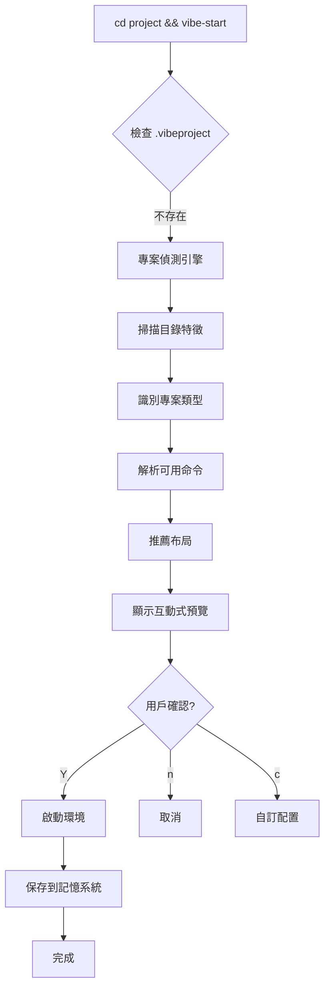
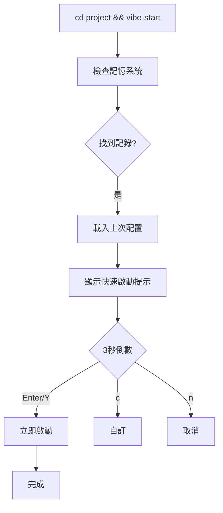
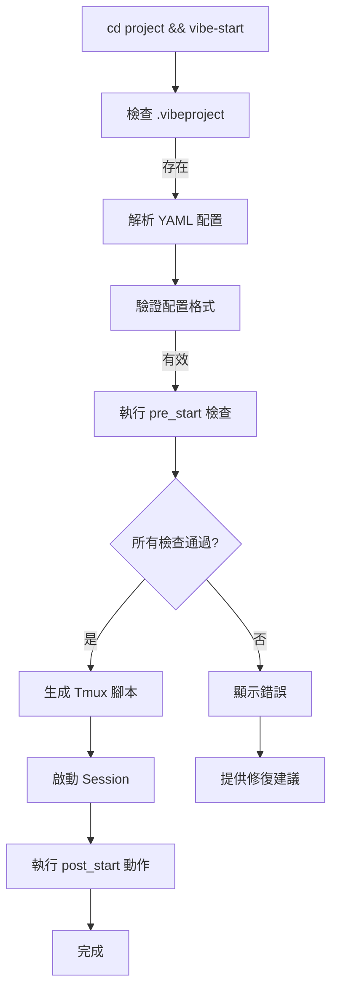

# vibe-start 設計文檔

**專案**: VibeGhostty - 智能專案啟動系統
**版本**: 1.0.0-alpha
**作者**: Frank Yang
**最後更新**: 2025-10-17

---

## 📋 目錄

- [專案概述](#專案概述)
- [設計目標](#設計目標)
- [技術架構](#技術架構)
- [配置格式規範](#配置格式規範)
- [工作流程設計](#工作流程設計)
- [命令 API 設計](#命令-api-設計)
- [模板系統](#模板系統)
- [智能偵測引擎](#智能偵測引擎)
- [記憶系統](#記憶系統)
- [健康檢查系統](#健康檢查系統)
- [UI/UX 設計](#uiux-設計)
- [實施路線圖](#實施路線圖)
- [技術決策](#技術決策)

---

## 專案概述

### 問題陳述

現有 VibeGhostty 提供優秀的終端配置和 Tmux 布局系統，但缺乏「專案感知」能力：
- ❌ 用戶需要手動選擇布局
- ❌ 需要手動執行多個命令（dev server, tests, db tools）
- ❌ 每次啟動專案都重複相同操作
- ❌ 缺乏專案類型智能識別

### 解決方案

`vibe-start` - 智能專案啟動系統：
- ✅ 一鍵啟動完整開發環境
- ✅ 自動偵測專案類型和技術棧
- ✅ 智能選擇最佳布局和命令
- ✅ 記住用戶偏好，越用越快

### 核心價值主張

```bash
# 傳統方式（8+ 步驟）
cd my-project
tmux new -s my-project
# 手動分割 panes
claude
# Ctrl+Space |
npm run dev
# Ctrl+Space -
npm run db:studio
# ...

# vibe-start 方式（1 步驟）
cd my-project
vibe-start
# 完成！環境就緒
```

---

## 設計目標

### 核心目標

1. **零學習成本**: 新用戶 `vibe-start` 即可使用
2. **智能化**: 自動理解專案並推薦最佳配置
3. **快速啟動**: 熟悉專案 < 3 秒完全就緒
4. **高度靈活**: 支援從零配置到完全自訂

### 非目標

- ❌ 不取代 IDE（VS Code, JetBrains）
- ❌ 不管理 Docker/Kubernetes（僅啟動本地服務）
- ❌ 不處理部署流程（僅開發環境）

### 成功指標

- 90% 專案可零配置啟動
- 用戶平均啟動時間 < 5 秒
- 首次使用成功率 > 95%
- 配置文件可讀性評分 > 8/10

---

## 技術架構

### 系統架構圖

```
┌─────────────────────────────────────────────────┐
│  vibe-start (CLI Entry Point)                   │
│  - 參數解析                                     │
│  - 工作流程協調                                 │
└──────────────┬──────────────────────────────────┘
               │
┌──────────────┴──────────────────────────────────┐
│  Core Modules                                    │
├──────────────────────────────────────────────────┤
│  ┌─────────────────┐  ┌─────────────────┐      │
│  │ Project         │  │ Template        │      │
│  │ Detector        │  │ Engine          │      │
│  │ - 類型偵測      │  │ - 模板解析      │      │
│  │ - 命令解析      │  │ - 布局生成      │      │
│  └─────────────────┘  └─────────────────┘      │
│                                                  │
│  ┌─────────────────┐  ┌─────────────────┐      │
│  │ Memory          │  │ Health          │      │
│  │ System          │  │ Checker         │      │
│  │ - 偏好記憶      │  │ - 環境檢查      │      │
│  │ - 快速恢復      │  │ - 服務啟動      │      │
│  └─────────────────┘  └─────────────────┘      │
└──────────────┬──────────────────────────────────┘
               │
┌──────────────┴──────────────────────────────────┐
│  Infrastructure Layer                            │
├──────────────────────────────────────────────────┤
│  ┌─────────┐  ┌─────────┐  ┌─────────┐         │
│  │ ta      │  │ tmux-   │  │ layouts/│         │
│  │ (複用)  │  │ launch  │  │ *.sh    │         │
│  │         │  │ (複用)  │  │ (複用)  │         │
│  └─────────┘  └─────────┘  └─────────┘         │
└──────────────┬──────────────────────────────────┘
               │
┌──────────────┴──────────────────────────────────┐
│  Tmux + Ghostty (Execution Environment)         │
└──────────────────────────────────────────────────┘
```

### 組件職責

#### 1. Project Detector（專案偵測器）
- 掃描專案目錄特徵
- 識別技術棧（Node.js, Python, Go, etc.）
- 解析可用命令（package.json scripts, Makefile）
- 推薦適合的布局模板

#### 2. Template Engine（模板引擎）
- 載入布局模板
- 變數替換和命令注入
- 生成 Tmux 腳本
- 支援自訂模板

#### 3. Memory System（記憶系統）
- 記錄專案偏好（~/.vibe/memory.json）
- 快速恢復上次配置
- 學習用戶習慣

#### 4. Health Checker（健康檢查器）
- 啟動前環境驗證
- Port 衝突檢測
- 依賴完整性檢查
- 服務狀態監控

---

## 配置格式規範

### .vibeproject 完整格式

```yaml
# ============================================
# VibeGhostty Project Configuration
# Format Version: 1.0
# ============================================

version: "1.0"
name: "Project Display Name"
description: "Optional project description"
type: nextjs-prisma  # 專案類型（可選，自動偵測）

# --------------------------------------------
# Quick Start Settings
# --------------------------------------------
quick_start: true  # 啟用記憶快速啟動
auto_confirm: false  # 自動確認（不顯示預覽）

# --------------------------------------------
# Mode Definitions
# --------------------------------------------
modes:
  # 開發模式（預設）
  dev:
    description: "開發模式 - Full stack development"
    layout:
      # 使用預設模板或自訂
      template: full-stack-web  # 預設模板名稱
      # 或使用 custom: true 完全自訂

      panes:
        - name: "🤖 Claude Code"
          size: 50%  # 百分比或固定值
          position: main  # main | top | bottom | left | right
          path: .  # 工作目錄（相對於專案根目錄）
          command: claude  # 執行命令
          focus: true  # 啟動時 focus
          color: blue  # pane 顏色標記（可選）
          title: "AI Assistant"  # pane 標題

        - name: "🚀 Dev Server"
          size: 25%
          position: bottom-left
          path: .
          command: npm run dev
          wait_for: 3  # 等待秒數後啟動
          auto_restart: true  # 崩潰時自動重啟
          health_check:
            type: http  # http | tcp | process
            url: "http://localhost:3000"
            interval: 5  # 檢查間隔（秒）
            timeout: 30  # 超時時間

        - name: "💾 Database"
          size: 15%
          command: npm run db:studio
          auto_restart: false
          on_exit: warn  # warn | ignore | restart

        - name: "📊 Logs"
          size: 10%
          command: tail -f .next/trace
          scroll_mode: true  # 啟用自動滾動

  # Debug 模式
  debug:
    description: "Debug 模式 - With Node Inspector"
    layout:
      custom: true
      panes:
        - name: "Claude"
          command: claude
        - name: "Node Debug"
          command: npm run dev-debug
          env:
            NODE_OPTIONS: "--inspect"
        - name: "Chrome DevTools"
          command: open chrome://inspect

  # Code Review 模式
  review:
    description: "Code Review - 雙 AI 比較"
    layout:
      template: ai-compare
      panes:
        - name: "Codex CLI"
          command: codex
        - name: "Claude Code"
          command: claude
        - name: "Git Diff"
          command: git diff --staged

# --------------------------------------------
# Pre-Start Checks（啟動前檢查）
# --------------------------------------------
pre_start:
  checks:
    # Port 檢查
    - type: port
      port: 3000
      action: prompt  # prompt | kill | skip | error
      message: "Port 3000 is in use. Kill existing process?"

    # Port 群組檢查
    - type: port_group
      ports: [3000, 5432, 6379]
      action: kill_all

    # 環境檔案檢查
    - type: env_file
      required: true
      file: .env
      example: .env.example
      action: copy_if_missing  # copy_if_missing | error | skip

    # 服務檢查
    - type: service
      name: postgresql
      action: start_if_down  # start_if_down | error | skip

    # 依賴檢查
    - type: dependencies
      check: node_modules
      action: prompt_install  # prompt_install | auto_install | skip
      command: npm install

    # Python venv 檢查
    - type: python_venv
      path: ./venv
      action: create_if_missing
      python_version: "3.11"

    # 自訂命令檢查
    - type: command
      command: which docker
      required: true
      error_message: "Docker is required but not installed"

# --------------------------------------------
# Post-Start Actions（啟動後執行）
# --------------------------------------------
post_start:
  actions:
    - type: message
      text: "🚀 Development environment ready!"

    - type: command
      command: echo "Server starting..."
      delay: 2  # 延遲秒數

    - type: open_url
      url: "http://localhost:3000"
      delay: 5
      browser: "Google Chrome"  # 可選

    - type: notify
      title: "VibeGhostty"
      message: "Project started successfully"

# --------------------------------------------
# Environment Variables（環境變數）
# --------------------------------------------
env:
  NODE_ENV: development
  DEBUG: "app:*"
  NEXT_TELEMETRY_DISABLED: "1"
  DATABASE_URL: "postgresql://localhost:5432/mydb"

# --------------------------------------------
# Aliases（命令別名）
# --------------------------------------------
aliases:
  db: "npm run db:studio"
  migrate: "npm run db:push"
  logs: "tail -f .next/trace"
  reset: "npm run db:reset && npm run dev"

# --------------------------------------------
# Hooks（生命週期鉤子）
# --------------------------------------------
hooks:
  before_start:
    - git fetch origin  # 拉取最新代碼
    - npm run type-check  # 型別檢查

  after_start:
    - echo "Ready to code!"

  before_stop:
    - git stash  # 暫存未提交變更

  on_error:
    - echo "Error occurred. Check logs."

# --------------------------------------------
# Advanced Settings（進階設定）
# --------------------------------------------
settings:
  # Session 名稱模板
  session_name: "${project_name}-${mode}"  # 變數: project_name, mode, date

  # 日誌設定
  logging:
    enabled: true
    path: .vibe/logs
    level: info  # debug | info | warn | error

  # 性能設定
  performance:
    startup_timeout: 60  # 總啟動超時（秒）
    parallel_start: true  # 並行啟動 panes

  # UI 設定
  ui:
    show_preview: true  # 顯示啟動預覽
    confirm_timeout: 10  # 自動確認超時（秒）
    use_emoji: true  # 使用 emoji 圖標
```

### 配置驗證規則

```yaml
# schema.yaml (配置驗證規則)
version:
  type: string
  required: true
  pattern: "^\d+\.\d+$"

name:
  type: string
  required: false
  max_length: 50

modes:
  type: object
  required: true
  min_properties: 1
  properties:
    [mode_name]:
      type: object
      properties:
        description:
          type: string
        layout:
          type: object
          required: true
          properties:
            template:
              type: string
              enum: [full-stack-web, ai-workspace, ai-compare, cli-development, custom]
            panes:
              type: array
              min_items: 1
              max_items: 10
```

---

## 工作流程設計

### 1. 零配置流程（首次使用）



### 2. 記憶恢復流程（已使用過）



### 3. 配置文件流程（有 .vibeproject）



---

## 命令 API 設計

### 主命令

```bash
vibe-start [OPTIONS] [MODE]
```

### 選項列表

```bash
# 基礎選項
-h, --help              顯示幫助訊息
-v, --version           顯示版本號
-V, --verbose           詳細輸出
-q, --quiet             安靜模式（最小輸出）

# 模式選擇
-m, --mode MODE         指定啟動模式（dev, debug, review）
-l, --list-modes        列出所有可用模式

# 配置管理
-i, --init              初始化配置文件
-c, --config FILE       使用指定配置文件
-e, --edit              編輯配置文件
--validate              驗證配置文件格式

# 行為控制
-y, --yes               自動確認所有提示
-n, --no-memory         不使用記憶系統
-f, --force             強制啟動（跳過檢查）
--dry-run               預覽不執行

# 專案偵測
-t, --type TYPE         指定專案類型
--detect                僅顯示偵測結果
--suggest               僅顯示建議配置

# Session 管理
-s, --session NAME      指定 session 名稱
-d, --detach            啟動後 detach
-a, --attach            Attach 到現有 session

# Debug
--debug                 Debug 模式
--trace                 追蹤執行過程
--log FILE              輸出日誌到文件
```

### 使用範例

```bash
# 基礎使用
vibe-start                      # 零配置啟動
vibe-start dev                  # 啟動 dev 模式
vibe-start --mode debug         # 同上

# 配置管理
vibe-start --init               # 生成配置模板
vibe-start --edit               # 編輯配置
vibe-start --validate           # 驗證配置
vibe-start --config custom.yaml # 使用自訂配置

# 專案偵測
vibe-start --detect             # 僅顯示偵測結果
vibe-start --suggest            # 顯示建議配置
vibe-start --type nextjs        # 強制指定類型

# 進階使用
vibe-start --yes --mode dev     # 自動確認啟動
vibe-start --dry-run            # 預覽不執行
vibe-start --no-memory          # 忽略記憶
vibe-start --force              # 跳過所有檢查

# Session 管理
vibe-start -s my-session        # 自訂 session 名稱
vibe-start -d                   # 啟動後 detach
vibe-start -a my-session        # Attach 到現有

# Debug
vibe-start --debug              # Debug 輸出
vibe-start --trace              # 追蹤每一步
vibe-start --log /tmp/vibe.log  # 輸出日誌
```

### 子命令

```bash
# 配置管理
vibe-start config init          # 初始化配置
vibe-start config edit          # 編輯配置
vibe-start config validate      # 驗證配置
vibe-start config show          # 顯示當前配置

# 模板管理
vibe-start template list        # 列出所有模板
vibe-start template show NAME   # 顯示模板內容
vibe-start template create NAME # 創建自訂模板
vibe-start template export      # 匯出當前配置為模板

# 記憶管理
vibe-start memory list          # 列出所有記憶
vibe-start memory show PROJECT  # 顯示專案記憶
vibe-start memory clear PROJECT # 清除專案記憶
vibe-start memory reset         # 重置所有記憶

# 健康檢查
vibe-start check                # 執行所有檢查
vibe-start check port           # 僅檢查 port
vibe-start check env            # 僅檢查環境
vibe-start check deps           # 僅檢查依賴
```

---

## 模板系統

### 預設模板庫

#### 1. full-stack-web.yaml

```yaml
# Full-Stack Web Development Template
name: "Full-Stack Web"
description: "4-pane layout for full-stack development"
适用: ["nextjs", "nextjs-prisma", "remix", "nuxt"]

layout:
  type: grid
  structure: |
    ┌─────────────────┬──────────┐
    │  Claude Code    │  Logs    │
    │  (50%)          │  (25%)   │
    ├─────────────────┼──────────┤
    │  Dev Server     │  DB Tool │
    │  (25%)          │  (25%)   │
    └─────────────────┴──────────┘

panes:
  - name: "Claude Code"
    size: 50%
    command: "claude"

  - name: "Dev Server"
    size: 25%
    command: "${dev_command}"

  - name: "Database"
    size: 15%
    command: "${db_command}"
    condition: "${has_database}"

  - name: "Logs"
    size: 10%
    command: "tail -f ${log_file}"

variables:
  dev_command: "npm run dev"
  db_command: "npm run db:studio"
  log_file: ".next/trace"
  has_database: true
```

#### 2. ai-workspace.yaml

```yaml
# AI Workspace Template (70/30 split)
name: "AI Workspace"
description: "Main AI tool with side panels"
适用: ["generic", "cli", "library"]

layout:
  type: main-sidebar
  structure: |
    ┌─────────────────────────┬─────────────┐
    │   Codex CLI (70%)       │  Claude     │
    │   主要工作區            │  Code (30%) │
    │                         ├─────────────┤
    │                         │  Monitor    │
    └─────────────────────────┴─────────────┘

panes:
  - name: "Codex CLI"
    size: 70%
    command: "codex"
    focus: true

  - name: "Claude Code"
    size: 15%
    command: "claude"

  - name: "Monitor"
    size: 15%
    command: "${monitor_command}"

variables:
  monitor_command: "npm test -- --watch"
```

#### 3. ai-compare.yaml

```yaml
# AI Compare Template (50/50 split)
name: "AI Compare"
description: "Side-by-side AI comparison"
适用: ["code-review", "comparison"]

layout:
  type: split-vertical
  structure: |
    ┌────────────────┬────────────────┐
    │  Codex CLI     │  Claude Code   │
    │  (50%)         │  (50%)         │
    ├────────────────┴────────────────┤
    │  Compare/Monitor (25%)          │
    └─────────────────────────────────┘

panes:
  - name: "Codex CLI"
    size: 50%
    command: "codex"

  - name: "Claude Code"
    size: 50%
    command: "claude"

  - name: "Comparison"
    size: 25%
    command: "git diff --staged"
```

#### 4. python-dev.yaml

```yaml
# Python Development Template
name: "Python Development"
description: "Python project with venv"
适用: ["python", "fastapi", "django"]

layout:
  type: horizontal

panes:
  - name: "Claude Code"
    size: 60%
    command: "claude"

  - name: "Python REPL/Server"
    size: 40%
    command: |
      source ${venv_path}/bin/activate
      ${python_command}

variables:
  venv_path: "./venv"
  python_command: "uvicorn main:app --reload"
```

#### 5. cli-development.yaml

```yaml
# CLI Tool Development Template
name: "CLI Development"
description: "Simple 2-pane for CLI tools"
适用: ["cli", "library", "typescript"]

layout:
  type: horizontal

panes:
  - name: "Claude Code"
    size: 70%
    command: "claude"
    focus: true

  - name: "Tests (Watch)"
    size: 30%
    command: "${test_command}"

variables:
  test_command: "npm test -- --watch"
```

### 模板變數系統

```yaml
# 內建變數
${project_name}         # 專案名稱
${project_path}         # 專案絕對路徑
${project_type}         # 專案類型
${mode}                 # 當前模式
${date}                 # 當前日期 YYYY-MM-DD
${time}                 # 當前時間 HH:MM:SS
${user}                 # 當前用戶名

# 偵測變數
${dev_command}          # 偵測到的 dev 命令
${build_command}        # 偵測到的 build 命令
${test_command}         # 偵測到的 test 命令
${db_command}           # 偵測到的 database 命令
${has_database}         # 是否有資料庫
${has_docker}           # 是否使用 Docker
${port}                 # 偵測到的 port

# 條件變數
${if:has_database}      # 條件判斷
${endif}
```

---

## 智能偵測引擎

### 偵測策略

```bash
#!/bin/bash
# detect_project.sh

detect_project_type() {
  local project_dir="$1"

  # Node.js 專案
  if [ -f "$project_dir/package.json" ]; then
    # 檢查框架
    if grep -q "next" "$project_dir/package.json"; then
      # 檢查是否有 Prisma
      if grep -q "@prisma/client" "$project_dir/package.json"; then
        echo "nextjs-prisma"
        return 0
      fi
      echo "nextjs"
      return 0
    fi

    if grep -q "vite" "$project_dir/package.json"; then
      echo "vite"
      return 0
    fi

    if grep -q "react-scripts" "$project_dir/package.json"; then
      echo "create-react-app"
      return 0
    fi

    echo "nodejs"
    return 0
  fi

  # Python 專案
  if [ -f "$project_dir/pyproject.toml" ]; then
    if grep -q "fastapi" "$project_dir/pyproject.toml"; then
      echo "fastapi"
      return 0
    fi
    echo "python"
    return 0
  fi

  if [ -f "$project_dir/requirements.txt" ]; then
    echo "python"
    return 0
  fi

  # Go 專案
  if [ -f "$project_dir/go.mod" ]; then
    echo "golang"
    return 0
  fi

  # Rust 專案
  if [ -f "$project_dir/Cargo.toml" ]; then
    echo "rust"
    return 0
  fi

  # Full-Stack 專案
  if [ -d "$project_dir/frontend" ] && [ -d "$project_dir/backend" ]; then
    echo "fullstack"
    return 0
  fi

  # Makefile 專案
  if [ -f "$project_dir/Makefile" ]; then
    echo "makefile"
    return 0
  fi

  # 預設
  echo "generic"
  return 0
}
```

### 命令解析器

```bash
#!/bin/bash
# parse_commands.sh

parse_package_json_scripts() {
  local package_json="$1"

  # 提取所有 scripts
  jq -r '.scripts // {} | to_entries | .[] | "\(.key):\(.value)"' "$package_json"
}

categorize_commands() {
  local commands="$1"

  declare -A categorized

  while IFS=: read -r name command; do
    case "$name" in
      dev|start|serve)
        categorized[dev]="$command"
        ;;
      build|compile)
        categorized[build]="$command"
        ;;
      test|jest|vitest)
        categorized[test]="$command"
        ;;
      db:*|prisma:*)
        categorized[database]="$command"
        ;;
      lint|format)
        categorized[quality]="$command"
        ;;
    esac
  done <<< "$commands"

  # 輸出分類結果
  for category in "${!categorized[@]}"; do
    echo "$category:${categorized[$category]}"
  done
}
```

### 推薦引擎

```bash
#!/bin/bash
# recommend_layout.sh

recommend_layout() {
  local project_type="$1"
  local has_database="$2"
  local has_frontend="$3"
  local has_backend="$4"

  case "$project_type" in
    nextjs-prisma|nextjs)
      if [ "$has_database" = "true" ]; then
        echo "full-stack-web"
      else
        echo "frontend-dev"
      fi
      ;;
    fullstack)
      echo "fullstack-dual"
      ;;
    python|fastapi|django)
      echo "python-dev"
      ;;
    cli|library|typescript)
      echo "cli-development"
      ;;
    *)
      echo "ai-workspace"
      ;;
  esac
}
```

---

## 記憶系統

### 記憶檔案結構

```json
// ~/.vibe/memory.json
{
  "version": "1.0",
  "projects": {
    "/Users/frank/projects/my-nextjs-app": {
      "name": "my-nextjs-app",
      "type": "nextjs-prisma",
      "last_mode": "dev",
      "last_used": "2025-10-17T14:30:00Z",
      "usage_count": 15,
      "avg_startup_time": 4.2,
      "preferences": {
        "auto_confirm": true,
        "pane_sizes": {
          "claude": 55,
          "dev": 25,
          "db": 15,
          "logs": 5
        },
        "custom_commands": {
          "dev": "npm run dev -- --turbo"
        }
      },
      "history": [
        {
          "date": "2025-10-17",
          "mode": "dev",
          "startup_time": 3.8,
          "duration": 7200
        }
      ]
    }
  },
  "global_preferences": {
    "default_mode": "dev",
    "show_preview": true,
    "auto_confirm_timeout": 10,
    "preferred_ai": "claude"
  }
}
```

### 學習邏輯

```bash
#!/bin/bash
# memory_learn.sh

update_memory() {
  local project_path="$1"
  local mode="$2"
  local startup_time="$3"

  # 讀取現有記憶
  local memory_file="$HOME/.vibe/memory.json"

  # 更新記憶
  jq --arg path "$project_path" \
     --arg mode "$mode" \
     --arg time "$startup_time" \
     --arg now "$(date -u +"%Y-%m-%dT%H:%M:%SZ")" \
     '
     .projects[$path] += {
       "last_mode": $mode,
       "last_used": $now,
       "usage_count": ((.projects[$path].usage_count // 0) + 1),
       "avg_startup_time": (
         ((.projects[$path].avg_startup_time // 0) * (.projects[$path].usage_count // 0) + ($time | tonumber)) /
         ((.projects[$path].usage_count // 0) + 1)
       )
     }
     ' "$memory_file" > "$memory_file.tmp"

  mv "$memory_file.tmp" "$memory_file"
}
```

---

## 健康檢查系統

### 檢查器實現

```bash
#!/bin/bash
# health_checks.sh

# Port 檢查
check_port() {
  local port="$1"
  local action="$2"

  if lsof -ti:$port > /dev/null 2>&1; then
    case "$action" in
      prompt)
        echo "⚠️  Port $port is in use"
        read -p "   Kill existing process? [Y/n]: " choice
        case "$choice" in
          y|Y|"")
            kill -9 $(lsof -ti:$port)
            echo "✅ Port $port freed"
            ;;
          *)
            echo "❌ Cancelled"
            return 1
            ;;
        esac
        ;;
      kill)
        kill -9 $(lsof -ti:$port)
        echo "✅ Port $port freed"
        ;;
      skip)
        echo "⚠️  Port $port is in use (skipped)"
        ;;
      error)
        echo "❌ Port $port is in use"
        return 1
        ;;
    esac
  else
    echo "✅ Port $port is available"
  fi

  return 0
}

# 環境檔案檢查
check_env_file() {
  local env_file="$1"
  local example_file="$2"
  local action="$3"

  if [ ! -f "$env_file" ]; then
    echo "❌ $env_file not found"

    case "$action" in
      copy_if_missing)
        if [ -f "$example_file" ]; then
          read -p "   Copy from $example_file? [Y/n]: " choice
          case "$choice" in
            y|Y|"")
              cp "$example_file" "$env_file"
              echo "✅ Created $env_file from $example_file"
              ;;
          esac
        fi
        ;;
      error)
        return 1
        ;;
    esac
  else
    echo "✅ $env_file exists"
  fi

  return 0
}

# 服務檢查
check_service() {
  local service="$1"
  local action="$2"

  case "$service" in
    postgresql)
      if ! pgrep -x postgres > /dev/null; then
        echo "❌ PostgreSQL is not running"

        if [ "$action" = "start_if_down" ]; then
          read -p "   Start PostgreSQL? [Y/n]: " choice
          case "$choice" in
            y|Y|"")
              brew services start postgresql
              echo "✅ PostgreSQL started"
              ;;
          esac
        fi
      else
        echo "✅ PostgreSQL is running"
      fi
      ;;
  esac

  return 0
}

# 依賴檢查
check_dependencies() {
  local check_path="$1"
  local action="$2"
  local install_cmd="$3"

  if [ ! -d "$check_path" ]; then
    echo "❌ Dependencies not installed ($check_path missing)"

    case "$action" in
      prompt_install)
        read -p "   Run '$install_cmd'? [Y/n]: " choice
        case "$choice" in
          y|Y|"")
            eval "$install_cmd"
            echo "✅ Dependencies installed"
            ;;
        esac
        ;;
      auto_install)
        eval "$install_cmd"
        echo "✅ Dependencies installed"
        ;;
    esac
  else
    echo "✅ Dependencies installed"
  fi

  return 0
}
```

---

## UI/UX 設計

### 互動式預覽

```bash
# 首次使用預覽
🔍 分析專案...
   ✓ 偵測到: Node.js + Next.js 14
   ✓ 框架: Next.js with Prisma
   ✓ 可用命令: dev, build, test, db:studio

📊 專案特徵:
   - Frontend: React + TypeScript
   - Database: PostgreSQL (Prisma)
   - API: Next.js API Routes

🎨 推薦布局: Full-Stack Web (4 panes)

   ┌─────────────────┬──────────┐
   │  Claude Code    │  Logs    │
   │  (50%)          │  (25%)   │
   ├─────────────────┼──────────┤
   │  Dev Server     │  DB      │
   │  (25%)          │  (25%)   │
   └─────────────────┴──────────┘

預覽命令:
  Pane 1 [🤖 Claude]: claude
  Pane 2 [🚀 Dev]: npm run dev
  Pane 3 [💾 DB]: npm run db:studio
  Pane 4 [📊 Logs]: tail -f .next/trace

確認啟動? [Y/n/c(customize)] █
```

### 快速啟動提示

```bash
# 已記憶專案
💾 找到已儲存配置
   上次使用: 2 天前 (dev mode)
   平均啟動: 4.2s
   使用次數: 15 次

🚀 快速啟動
   Layout: Full-Stack Web
   4 panes: Claude | Dev | DB | Logs

   3 秒後自動啟動...

   [Enter] 立即啟動  [c] 自訂  [n] 取消  █
```

### 進度指示器

```bash
# 啟動過程
🚀 啟動 my-nextjs-app (dev mode)

✅ Pre-start checks (1.2s)
   ✓ Port 3000 available
   ✓ .env exists
   ✓ PostgreSQL running
   ✓ node_modules installed

⏳ Creating Tmux session... (0.5s)
⏳ Setting up panes... (1.0s)
   ✓ Pane 1: Claude Code
   ✓ Pane 2: Dev Server
   ✓ Pane 3: Database
   ✓ Pane 4: Logs

⏳ Starting services... (2.5s)
   ✓ Dev server starting on port 3000
   ✓ Prisma Studio on port 5555

✅ Environment ready! (Total: 4.2s)

🌐 Opening http://localhost:3000...
```

### 錯誤處理

```bash
# 啟動失敗
❌ Startup failed!

Error in Pane 2 (Dev Server):
   Port 3000 already in use
   Process: node (PID 12345)

建議操作:
   1. [K] Kill process and retry
   2. [C] Change port to 3001
   3. [V] View full error log
   4. [Q] Quit

選擇 [1-4]: █
```

---

## 實施路線圖

### 階段 1: MVP (Week 1-2)

**目標**: 基礎功能可用

**任務**:
- [ ] 創建 vibe-start 主腳本
- [ ] 實現專案類型偵測（5 種類型）
- [ ] 創建 3 個預設模板
- [ ] 實現互動式選單
- [ ] 基礎錯誤處理

**交付物**:
- vibe-start 可執行檔
- 3 個模板（nextjs, python, generic）
- 基礎文檔

**成功標準**:
- 能偵測 Next.js 專案
- 能啟動 4-pane 布局
- 能執行基礎命令

### 階段 2: 智能化 (Week 3-4)

**目標**: 智能偵測和記憶系統

**任務**:
- [ ] 實現記憶系統（~/.vibe/memory.json）
- [ ] package.json scripts 解析器
- [ ] 啟動前健康檢查（3 種）
- [ ] .vibeproject YAML 解析
- [ ] 配置驗證器

**交付物**:
- 記憶系統
- 健康檢查器
- YAML 配置支援

**成功標準**:
- 第二次啟動 < 3 秒
- 自動檢測 port 衝突
- 可讀取 .vibeproject

### 階段 3: 進階功能 (Week 5-6)

**目標**: 多模式和進階配置

**任務**:
- [ ] 多模式支援（dev, debug, review）
- [ ] 動態 pane 調整
- [ ] 模板變數系統
- [ ] Post-start actions
- [ ] 命令別名系統

**交付物**:
- 多模式支援
- 完整模板系統
- 進階配置範例

**成功標準**:
- 支援 3+ 模式切換
- 模板變數可正常替換
- Post-start 鉤子可執行

### 階段 4: 優化和文檔 (Week 7-8)

**目標**: 穩定性和用戶體驗

**任務**:
- [ ] 性能優化（並行啟動）
- [ ] 錯誤訊息優化
- [ ] 完整用戶文檔
- [ ] 範例專案配置
- [ ] 測試覆蓋

**交付物**:
- 完整用戶手冊
- 10+ 配置範例
- 測試套件

**成功標準**:
- 啟動時間 < 5 秒
- 錯誤訊息清晰
- 文檔完整

---

## 技術決策

### 1. 為什麼選擇 YAML？

**對比分析**:

| 格式 | 優點 | 缺點 | 分數 |
|------|------|------|------|
| YAML | 可讀性高、支援註解、層次清晰 | 需要 yq 工具 | ⭐⭐⭐⭐⭐ |
| JSON | 原生支援、jq 廣泛 | 無註解、可讀性差 | ⭐⭐⭐ |
| TOML | 簡單明瞭 | 嵌套支援弱 | ⭐⭐⭐ |

**決定**: 選擇 YAML
**原因**:
- 用戶專案多為複雜配置
- 需要註解幫助團隊理解
- yq 工具成熟易用

### 2. 為什麼複用現有工具？

**現有工具**:
- `ta`: Session 管理
- `tmux-launch`: 布局引擎
- `layouts/*.sh`: 布局腳本

**決定**: 複用而非重寫
**原因**:
- 避免重複造輪子
- 保持架構一致性
- 降低維護成本

### 3. 記憶系統存儲位置

**選項**:
- 專案內（.vibe/）
- 用戶目錄（~/.vibe/）
- 系統目錄（/var/lib/vibe/）

**決定**: `~/.vibe/memory.json`
**原因**:
- 跨專案共享
- 不污染專案目錄
- 用戶完全控制

### 4. 健康檢查策略

**選項**:
- 全部自動修復
- 全部提示用戶
- 智能選擇

**決定**: 智能選擇 + 可配置
**原因**:
- Port 衝突: 提示（可能故意的）
- 缺少 .env: 自動複製（安全）
- 服務未啟動: 提示（可能不需要）

### 5. 模板變數語法

**選項**:
- `$var` (Shell style)
- `{{var}}` (Mustache style)
- `${var}` (混合 style)

**決定**: `${var}`
**原因**:
- 與 Shell 變數一致
- 支援條件判斷 `${if:var}`
- 易於解析

---

## 附錄

### A. 專案類型偵測規則表

| 專案類型 | 偵測特徵 | 推薦模板 | 常用命令 |
|---------|---------|---------|---------|
| nextjs-prisma | package.json (next + @prisma/client) | full-stack-web | dev, db:studio |
| nextjs | package.json (next) | frontend-dev | dev, build |
| vite | package.json (vite) | frontend-dev | dev, build |
| fastapi | pyproject.toml (fastapi) | python-dev | uvicorn |
| python | requirements.txt or pyproject.toml | python-dev | python |
| golang | go.mod | cli-development | go run |
| rust | Cargo.toml | cli-development | cargo run |
| fullstack | frontend/ + backend/ | fullstack-dual | make dev |
| generic | - | ai-workspace | - |

### B. 配置驗證錯誤碼

| 錯誤碼 | 說明 | 範例 |
|-------|------|------|
| E001 | 缺少必要欄位 | `version` field is required |
| E002 | 格式錯誤 | Invalid YAML syntax at line 10 |
| E003 | 類型不符 | `size` must be a number |
| E004 | 超出範圍 | `panes` count exceeds maximum (10) |
| E005 | 無效值 | Unknown template: `invalid-template` |
| E006 | 命令不存在 | Command `npm run invalid` not found |
| W001 | 建議性警告 | Consider adding `pre_start` checks |

### C. 性能基準

| 操作 | 目標時間 | 最大時間 |
|------|---------|---------|
| 專案偵測 | < 0.5s | 1s |
| 配置解析 | < 0.2s | 0.5s |
| 健康檢查 | < 2s | 5s |
| Session 創建 | < 1s | 2s |
| 總啟動時間（首次） | < 5s | 10s |
| 總啟動時間（記憶） | < 3s | 5s |

### D. 相容性矩陣

| 工具/版本 | 最低要求 | 推薦版本 | 測試版本 |
|----------|---------|---------|---------|
| Bash | 4.0 | 5.0+ | 5.2 |
| Tmux | 3.0 | 3.3+ | 3.4 |
| yq | 4.0 | 4.30+ | 4.35 |
| jq | 1.6 | 1.7+ | 1.7 |
| macOS | 11.0 | 13.0+ | 14.0 |

---

## 版本歷史

### v1.0.0-alpha (2025-10-17)
- 初始設計文檔
- 定義核心架構
- 規範配置格式
- 設計工作流程

---

**文檔狀態**: ✅ 完成初稿
**下一步**: 開始 MVP 實作
**負責人**: Frank Yang
**審查**: 待定
