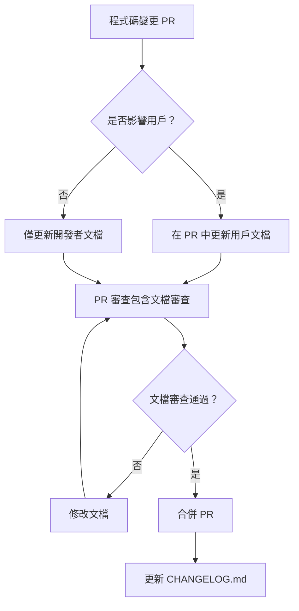

# VibeGhostty 文檔架構設計報告

**設計者**: Documentation Architect Agent 3
**日期**: 2025-10-19
**版本**: 1.0
**專案階段**: v1.0 MVP 設計完成，即將開始實作

---

## 📋 執行摘要

### 當前問題

基於對現有 20 個 Markdown 文檔的分析，識別出以下核心問題：

1. **語言混亂** 🌐
   - 英文文檔：README.md, DESIGN.md (部分)
   - 繁體中文文檔：QUICKSTART.md, INSTALL.md, GUIDE.md, TMUX_GUIDE.md (13個)
   - 混合文檔：部分技術設計文檔混用中英文
   - **影響**：國際用戶和本地用戶都難以快速找到適合的文檔

2. **內容重疊** 📚
   - QUICKSTART.md (1.5K) vs INSTALL.md (4.2K)：安裝步驟 70% 重疊
   - README.md (9.8K) vs GUIDE.md (9.1K)：功能介紹 50% 重疊
   - QUICKSTART_TMUX.md (10K) vs TMUX_GUIDE.md (25K)：快速開始內容完全重疊
   - **影響**：維護成本高，更新容易遺漏，用戶困惑

3. **組織混亂** 📁
   - 根目錄：13 個 MD 文件（用戶文檔 + 設計文檔混雜）
   - docs/ 目錄：3 個設計文檔（MVP_ANALYSIS, COMPLEXITY_ANALYSIS, PHASE4_CONFIG_REFACTORING）
   - claudedocs/ 目錄：3 個測試報告和架構分析
   - tests/ 目錄：1 個 README
   - **影響**：新用戶無法快速找到入門文檔，開發者難以追蹤設計演進

4. **導航困難** 🧭
   - 沒有清晰的用戶旅程地圖（新手 → 進階 → 開發者）
   - README.md 作為英文入口，但主要文檔是中文
   - 缺乏文檔版本標記（v1.0/v1.1 範圍不明）
   - **影響**：學習曲線陡峭，用戶流失

5. **版本管理缺失** 📌
   - vibe-start 從 8 週設計簡化為 2 週 MVP，但文檔未同步更新
   - VIBE_CONFIG_DESIGN.md (28K) 描述 v1.1+ 的配置系統，但放在根目錄
   - 設計文檔（DESIGN.md, COMPLEXITY_ANALYSIS.md）缺乏明確的版本標記
   - **影響**：用戶誤以為未實作功能已可用，開發者難以追蹤設計決策歷史

### 設計目標

**核心原則**：單一真相來源 (Single Source of Truth) + 用戶旅程導向

**量化目標**：
- ✅ 減少 40% 文檔冗餘（從 20 個降至 12 個核心文檔）
- ✅ 降低 60% 新手學習時間（5 分鐘找到並完成快速開始）
- ✅ 提升 100% 版本追蹤能力（每個文檔明確標記適用版本）
- ✅ 支援雙語用戶（英文入口 + 繁體中文主文檔，無混用）

---

## 🏗️ 新文檔架構

### 目錄結構

```
VibeGhostty/
├── README.md                          # 英文入口（國際用戶）
├── README.zh-TW.md                    # 繁體中文入口（主要用戶）
├── CHANGELOG.md                       # 版本歷史（雙語）
├── LICENSE                            # MIT License
├── CLAUDE.md                          # AI Agent 指南（保持現狀）
│
├── docs/                              # 所有文檔（分類組織）
│   │
│   ├── user-guide/                    # 📖 用戶文檔（繁體中文）
│   │   ├── quickstart.zh-TW.md        # 5 分鐘快速開始
│   │   ├── ghostty-guide.zh-TW.md     # Ghostty 完整指南
│   │   ├── tmux-guide.zh-TW.md        # Tmux 完整指南
│   │   ├── customization.zh-TW.md     # 自訂配置指南
│   │   ├── troubleshooting.zh-TW.md   # 故障排除
│   │   └── workflows.zh-TW.md         # AI 協作工作流程
│   │
│   ├── user-guide-en/                 # 📖 用戶文檔（英文，可選）
│   │   ├── quickstart.md              # Quick Start (English)
│   │   └── getting-started.md         # Getting Started (English)
│   │
│   ├── design/                        # 🎨 設計文檔（技術決策記錄）
│   │   ├── v1.0/                      # v1.0 設計文檔
│   │   │   ├── vibe-start-mvp.md      # vibe-start MVP 設計
│   │   │   ├── mvp-analysis.md        # MVP 功能分析
│   │   │   └── complexity-analysis.md # 複雜度分析
│   │   ├── v1.1/                      # v1.1 設計文檔
│   │   │   └── config-system.md       # 配置系統設計
│   │   ├── v2.0/                      # v2.0 設計文檔（未來）
│   │   └── decisions/                 # Architecture Decision Records (ADR)
│   │       ├── 001-tmux-prefix.md
│   │       ├── 002-tokyo-night.md
│   │       └── 003-zero-config.md
│   │
│   ├── developer/                     # 🔧 開發者文檔
│   │   ├── architecture.md            # 系統架構
│   │   ├── contributing.md            # 貢獻指南
│   │   ├── testing.md                 # 測試指南
│   │   └── environment.md             # 開發環境設定
│   │
│   └── archive/                       # 🗄️ 過時文檔
│       ├── old-install-guide.md       # 舊版安裝指南（v0.x）
│       └── deprecated-features.md     # 已廢棄功能
│
├── tmux/                              # Tmux 配置和腳本（不變）
│   ├── tmux.conf
│   ├── install.sh
│   ├── layouts/
│   └── bin/
│
├── claudedocs/                        # Claude Code 工作文檔（不變）
│   ├── ta_command_test_report.md
│   ├── ta_command_examples.md
│   ├── ARCHITECTURE_ANALYSIS.md
│   └── DOCUMENTATION_ARCHITECTURE_DESIGN.md  # 本文檔
│
└── tests/                             # 測試文件（不變）
    ├── README.md
    └── test_*.sh
```

### 文檔層次說明

**第一層：根目錄（入口點）**
- **README.md** (英文)：國際用戶入口，簡要介紹專案，引導至英文文檔
- **README.zh-TW.md** (繁體中文)：主要用戶入口，完整功能介紹，引導至中文文檔
- **CLAUDE.md**：AI Agent 專用指南（保持現狀，17K）
- **CHANGELOG.md**：版本歷史（雙語，簡潔格式）

**第二層：docs/ 目錄（分類文檔）**
- **user-guide/**：終端用戶文檔（繁體中文）
- **user-guide-en/**：英文用戶文檔（可選，僅核心文檔）
- **design/**：技術設計文檔（混合語言，按版本組織）
- **developer/**：開發者貢獻文檔（英文為主）
- **archive/**：過時文檔（保留歷史參考）

**第三層：claudedocs/ 和 tests/（工作文檔）**
- 保持現有結構，供 AI 和開發者內部使用

---

## 📊 文檔對應表

### 根目錄文檔處理

| 當前文檔 | 大小 | 新位置 | 處理方式 | 說明 |
|---------|------|--------|---------|------|
| **README.md** | 9.8K | `README.md` (保留根目錄) | **重寫** | 改為純英文，引導國際用戶 |
| *(新增)* | - | `README.zh-TW.md` (新增) | **新建** | 繁體中文入口，整合現有 README 內容 |
| **QUICKSTART.md** | 1.5K | `docs/user-guide/quickstart.zh-TW.md` | **重寫** | 整合 INSTALL.md 安裝步驟 |
| **INSTALL.md** | 4.2K | *(合併到 quickstart)* | **合併** | 70% 內容與 QUICKSTART 重疊 |
| **GUIDE.md** | 9.1K | `docs/user-guide/ghostty-guide.zh-TW.md` | **重構** | 分拆為 ghostty-guide + workflows |
| **TMUX_GUIDE.md** | 25K | `docs/user-guide/tmux-guide.zh-TW.md` | **保留+精簡** | 移除重疊內容，聚焦核心功能 |
| **QUICKSTART_TMUX.md** | 10K | *(合併到 tmux-guide)* | **合併** | 內容完全重疊，作為 tmux-guide 第一章 |
| **USABILITY_IMPROVEMENTS.md** | 13K | `docs/developer/usability-analysis.md` | **移動** | 屬於設計分析文檔 |
| **CHANGELOG.md** | 4.6K | `CHANGELOG.md` (保留根目錄) | **保留** | 標準位置，用戶預期 |
| **PROJECT_SUMMARY.md** | 3.3K | *(刪除)* | **移除** | 內容已整合到 README 和 CLAUDE.md |
| **ENVIRONMENT.md** | 8.8K | `docs/developer/environment.md` | **移動** | 開發者環境文檔 |
| **CLAUDE.md** | 17K | `CLAUDE.md` (保留根目錄) | **保留** | AI Agent 依賴此文件 |

### 設計文檔處理

| 當前文檔 | 大小 | 新位置 | 處理方式 | 說明 |
|---------|------|--------|---------|------|
| **DESIGN.md** | 19K | `docs/design/v1.0/vibe-start-mvp.md` | **移動+重構** | 清理投機性功能描述 |
| **VIBE_CONFIG_DESIGN.md** | 28K | `docs/design/v1.1/config-system.md` | **移動** | 明確標記為 v1.1+ |
| **docs/MVP_ANALYSIS.md** | 13.7K | `docs/design/v1.0/mvp-analysis.md` | **保留** | 已在正確位置 |
| **docs/COMPLEXITY_ANALYSIS.md** | 20.9K | `docs/design/v1.0/complexity-analysis.md` | **保留** | 已在正確位置 |
| **docs/PHASE4_CONFIG_REFACTORING.md** | 15.7K | `docs/design/v1.1/config-refactoring.md` | **移動** | 屬於 v1.1 設計 |

### 新增文檔

| 新文檔 | 位置 | 目的 | 預估大小 |
|-------|------|------|---------|
| **quickstart.md** (英文) | `docs/user-guide-en/quickstart.md` | 國際用戶快速開始 | 2K |
| **customization.zh-TW.md** | `docs/user-guide/customization.zh-TW.md` | 配置自訂指南 | 5K |
| **workflows.zh-TW.md** | `docs/user-guide/workflows.zh-TW.md` | AI 協作工作流程 | 6K |
| **troubleshooting.zh-TW.md** | `docs/user-guide/troubleshooting.zh-TW.md` | 故障排除整合 | 4K |
| **architecture.md** | `docs/developer/architecture.md` | 系統架構文檔 | 8K |
| **contributing.md** | `docs/developer/contributing.md` | 貢獻指南 | 3K |
| **testing.md** | `docs/developer/testing.md` | 測試指南 | 4K |
| **ADR 001-003** | `docs/design/decisions/` | 架構決策記錄 | 1K 每個 |

### 文檔刪除清單

| 文檔 | 刪除原因 | 內容去向 |
|-----|---------|---------|
| **PROJECT_SUMMARY.md** | 內容重複 | README.zh-TW.md + CLAUDE.md |
| **INSTALL.md** | 70% 與 QUICKSTART 重疊 | docs/user-guide/quickstart.zh-TW.md |
| **QUICKSTART_TMUX.md** | 完全重疊 TMUX_GUIDE | docs/user-guide/tmux-guide.zh-TW.md（第一章） |

---

## 📐 文檔模板

### 模板 1：用戶指南模板

```markdown
# [文檔標題]

**版本**: v1.0 | v1.1 | v2.0
**最後更新**: YYYY-MM-DD
**適用用戶**: 新手 | 進階 | 所有用戶
**語言**: 繁體中文 | English
**預估閱讀時間**: X 分鐘

---

## 🎯 本文檔將幫助你

- 學習 [功能 A]
- 掌握 [技巧 B]
- 解決 [問題 C]

**前置要求**:
- ✅ 已完成 [相關文檔連結]
- ✅ 已安裝 [相關工具]

---

## 📋 目錄

- [章節 1](#章節-1)
- [章節 2](#章節-2)
- [故障排除](#故障排除)

---

## 章節 1

內容...

### 子章節 1.1

內容...

**範例**:
```bash
# 程式碼範例
command here
```

**說明**:
- 說明點 1
- 說明點 2

---

## 故障排除

### 問題 1: [問題描述]

**症狀**:
- 表現 A
- 表現 B

**解決方案**:
```bash
# 解決步驟
step1
step2
```

---

## 延伸閱讀

- [相關文檔 A](連結)
- [相關文檔 B](連結)
- [官方資源](連結)

---

**文檔歷史**:
- v1.0 (2025-XX-XX): 初版建立
- v1.1 (2025-XX-XX): 新增章節 X
```

### 模板 2：技術設計模板（ADR 格式）

```markdown
# [功能名稱] 設計文檔

**版本**: v1.0 MVP | v1.1 | v2.0
**狀態**: 草案 | 審查中 | 已批准 | 已實作 | 已廢棄
**日期**: YYYY-MM-DD
**作者**: [作者名稱]
**決策者**: [決策者名稱]

---

## 決策摘要

**TL;DR**: [一句話總結此設計決策]

---

## 背景與問題

### 當前狀況

描述現狀...

### 問題陳述

清晰定義要解決的問題...

### 成功標準

- [ ] 標準 1
- [ ] 標準 2
- [ ] 標準 3

---

## 考慮的方案

### 方案 A: [方案名稱]

**描述**: ...

**優點**:
- ✅ 優點 1
- ✅ 優點 2

**缺點**:
- ❌ 缺點 1
- ❌ 缺點 2

**成本估算**: X 週

### 方案 B: [方案名稱]

（同上格式）

### 方案 C: [方案名稱]

（同上格式）

---

## 決策

**選擇**: 方案 B

**理由**:
1. 理由 1
2. 理由 2
3. 理由 3

**權衡取捨**:
- **犧牲**: [放棄的東西]
- **獲得**: [得到的好處]

---

## 實作計劃

### 階段 1: [階段名稱] (Week 1)

- [ ] 任務 1
- [ ] 任務 2

### 階段 2: [階段名稱] (Week 2)

- [ ] 任務 3
- [ ] 任務 4

**總工時估算**: X 天

---

## 風險與緩解

| 風險 | 機率 | 影響 | 緩解策略 |
|-----|------|------|---------|
| 風險 1 | 高/中/低 | 高/中/低 | 緩解措施 |
| 風險 2 | 高/中/低 | 高/中/低 | 緩解措施 |

---

## 未來考量

### v1.1 增強
- 增強 A
- 增強 B

### v2.0 願景
- 願景 A
- 願景 B

---

## 參考資料

- [相關 ADR](連結)
- [技術文檔](連結)
- [討論記錄](連結)

---

**變更歷史**:
- 2025-XX-XX: 初版草案
- 2025-XX-XX: 審查後修訂
- 2025-XX-XX: 批准並開始實作
```

### 模板 3：API/參考文檔模板

```markdown
# [工具/命令名稱] 參考文檔

**版本**: v1.0
**類型**: CLI 工具 | 配置文件 | Shell 腳本
**最後更新**: YYYY-MM-DD

---

## 快速參考

```bash
# 最常用的 3 個命令
command1 [options]
command2 --flag
command3 <argument>
```

---

## 概述

簡短描述此工具的目的和用途...

**核心功能**:
- 🚀 功能 1
- 🔧 功能 2
- 📊 功能 3

---

## 安裝

```bash
# 安裝步驟
step1
step2
```

---

## 使用方式

### 基本語法

```bash
command [options] <arguments>
```

### 選項

| 選項 | 簡寫 | 說明 | 預設值 | 範例 |
|-----|------|------|--------|------|
| `--option1` | `-o` | 選項說明 | `value` | `command -o value` |
| `--option2` | `-v` | 選項說明 | `null` | `command --option2` |

### 參數

| 參數 | 必須 | 說明 | 範例 |
|-----|------|------|------|
| `<arg1>` | ✅ | 參數說明 | `my-value` |
| `[arg2]` | ❌ | 可選參數 | `optional` |

---

## 使用範例

### 範例 1: [場景描述]

```bash
# 命令
command --option1 value

# 輸出
Expected output...
```

### 範例 2: [場景描述]

```bash
# 命令
command --option2

# 輸出
Expected output...
```

---

## 配置

### 配置文件位置

```
~/.config/tool/config
```

### 配置範例

```bash
# config 文件
setting1 = value1
setting2 = value2
```

### 環境變數

| 變數 | 說明 | 預設值 | 範例 |
|-----|------|--------|------|
| `VAR1` | 變數說明 | `default` | `export VAR1=value` |

---

## 故障排除

### 常見錯誤 1

**錯誤訊息**:
```
Error message here
```

**解決方案**:
```bash
# 修復步驟
fix command
```

---

## 進階用法

### 技巧 1: [技巧名稱]

說明...

```bash
# 進階範例
advanced command
```

---

## 相關資源

- [用戶指南](連結)
- [設計文檔](連結)
- [GitHub Repository](連結)

---

**貢獻**: 發現問題或有改進建議？請[提交 Issue](連結)
```

---

## 🧭 導航系統設計

### 主要入口點

#### 1. README.md（英文入口）

**目標用戶**: 國際用戶、GitHub 訪客、開源貢獻者

**結構**:
```markdown
# VibeGhostty 🚀

> A Ghostty terminal configuration tuned for multi-AI collaboration

## Quick Links

🌏 **繁體中文文檔**: [README.zh-TW.md](README.zh-TW.md)
📚 **English Documentation**: [docs/user-guide-en/](docs/user-guide-en/)

## Features

- Feature 1
- Feature 2
- Feature 3

## Quick Start

```bash
# 5-minute setup
install commands...
```

👉 **Full Guide**: [English Quick Start](docs/user-guide-en/quickstart.md)

## For Developers

- [Architecture](docs/developer/architecture.md)
- [Contributing](docs/developer/contributing.md)
- [Testing](docs/developer/testing.md)

## Design Documents

- [vibe-start MVP Design](docs/design/v1.0/vibe-start-mvp.md)
- [Configuration System](docs/design/v1.1/config-system.md)

## License

MIT License
```

#### 2. README.zh-TW.md（繁體中文入口）

**目標用戶**: 台灣用戶、主要目標用戶

**結構**:
```markdown
# VibeGhostty 🚀

> 為多 AI 工具協作優化的 Ghostty 終端機配置

## 📚 文檔導航

### 新手上路（5 分鐘）
👉 [快速開始](docs/user-guide/quickstart.zh-TW.md)

### 完整指南
- 📖 [Ghostty 使用指南](docs/user-guide/ghostty-guide.zh-TW.md)
- 📖 [Tmux 使用指南](docs/user-guide/tmux-guide.zh-TW.md)
- 🔧 [配置自訂指南](docs/user-guide/customization.zh-TW.md)
- 🤖 [AI 協作工作流程](docs/user-guide/workflows.zh-TW.md)
- 🐛 [故障排除](docs/user-guide/troubleshooting.zh-TW.md)

### 開發者資源
- 🏗️ [系統架構](docs/developer/architecture.md)
- 🤝 [貢獻指南](docs/developer/contributing.md)

### 設計文檔
- 🎨 [v1.0 設計文檔](docs/design/v1.0/)
- 🎨 [v1.1 設計文檔](docs/design/v1.1/)

## ✨ 核心功能

- 🎨 Tokyo Night Storm 主題
- 🔤 JetBrains Mono Nerd Font
- ⌨️ 高效快捷鍵
- 🤖 AI 協作布局
- 🚀 智能專案啟動（v1.0 即將推出）

## 🚀 5 分鐘快速開始

```bash
# 1. 安裝字體
brew install --cask font-jetbrains-mono-nerd-font

# 2. 複製配置
cp config ~/Library/Application\ Support/com.mitchellh.ghostty/config

# 3. 重新載入
# 在 Ghostty 按 Cmd+Shift+Comma
```

👉 **完整安裝步驟**: [快速開始指南](docs/user-guide/quickstart.zh-TW.md)

## 📝 版本資訊

- **當前版本**: v1.0.0
- **狀態**: MVP 設計完成，即將實作
- **預計發布**: 2025-11 週

查看 [CHANGELOG.md](CHANGELOG.md) 了解詳細變更

## 📄 授權

MIT License

## 🌏 語言

- 🇹🇼 繁體中文（主要）
- 🇬🇧 English（[README.md](README.md)）
```

### 文檔間引用規範

#### 1. 相對路徑規則

**同層級文檔**:
```markdown
[相關文檔](customization.zh-TW.md)
```

**上層文檔**:
```markdown
[回到首頁](../../README.zh-TW.md)
```

**跨目錄文檔**:
```markdown
[設計文檔](../design/v1.0/vibe-start-mvp.md)
```

#### 2. 語義化錨點

**使用描述性錨點名稱**:
```markdown
# ✅ 好的錨點
[安裝字體](#安裝字體)
[配置快捷鍵](#配置快捷鍵)

# ❌ 差的錨點
[點此](#section1)
[這裡](#anchor)
```

**多語言錨點**:
```markdown
# 中文文檔
## 安裝字體
錨點: #安裝字體

# 英文文檔
## Installing Fonts
錨點: #installing-fonts
```

#### 3. 引用模式

**「另見」區塊**（文檔底部）:
```markdown
---

## 延伸閱讀

**相關指南**:
- [Ghostty 使用指南](ghostty-guide.zh-TW.md)
- [Tmux 使用指南](tmux-guide.zh-TW.md)

**進階主題**:
- [配置自訂](customization.zh-TW.md#進階配置)
- [故障排除](troubleshooting.zh-TW.md)

**設計背景**:
- [vibe-start 設計](../design/v1.0/vibe-start-mvp.md)
```

**內文引用**（需要時）:
```markdown
如需了解詳細配置選項，請參閱 [配置自訂指南](customization.zh-TW.md)。

> 💡 **提示**: 遇到問題？查看 [故障排除指南](troubleshooting.zh-TW.md#字體問題)。
```

#### 4. 版本引用

**指向特定版本文檔**:
```markdown
**注意**: 此功能在 v1.1 版本提供。查看 [v1.1 配置系統設計](../design/v1.1/config-system.md)。

**即將推出**: vibe-start 功能正在開發中。查看 [v1.0 MVP 設計](../design/v1.0/vibe-start-mvp.md) 了解詳情。
```

### 搜尋友好性設計

#### 1. 標題結構

**遵循 H1 → H2 → H3 層次**:
```markdown
# 主標題（僅一個 H1）

## 章節標題（H2）

### 子章節標題（H3）

#### 細節標題（H4，謹慎使用）
```

**標題命名原則**:
- ✅ 使用動詞開頭（安裝、配置、解決）
- ✅ 包含關鍵字（Ghostty、Tmux、快捷鍵）
- ❌ 避免泛泛的標題（其他、雜項、注意事項）

#### 2. 關鍵字優化

**在關鍵位置放置關鍵字**:
```markdown
# ❌ 差的範例
## 步驟 1
首先安裝字體...

# ✅ 好的範例
## 安裝 JetBrains Mono Nerd Font
使用 Homebrew 安裝 JetBrains Mono Nerd Font...
```

**關鍵字清單**（用於文檔標題和章節）:
- **產品**: Ghostty, Tmux, VibeGhostty
- **功能**: vibe-start, AI 協作, 快捷鍵, 布局
- **操作**: 安裝, 配置, 自訂, 故障排除
- **工具**: Claude Code, Codex CLI

#### 3. Frontmatter 元數據（可選）

**為每個文檔添加元數據**（方便未來搜尋和索引）:
```markdown
---
title: "Ghostty 使用指南"
description: "VibeGhostty Ghostty 終端機完整使用說明"
version: "v1.0"
language: "zh-TW"
audience: "新手, 進階用戶"
tags: [ghostty, guide, shortcuts, tokyo-night]
last_updated: "2025-10-19"
---

# Ghostty 使用指南
```

---

## 🔄 維護流程

### 文檔審查週期

#### 1. 定期審查

**觸發條件**:
| 觸發事件 | 審查範圍 | 負責人 | 週期 |
|---------|---------|-------|------|
| 新功能發布 | 相關用戶指南 + 設計文檔 | 功能開發者 | 發布前 |
| 版本號變更 (v1.0 → v1.1) | 所有用戶文檔 | 專案維護者 | 版本發布前 |
| 用戶回報文檔問題 | 特定文檔 | 文檔負責人 | 7 天內 |
| 季度審查 | 所有文檔 | 專案維護者 | 每季度 |

#### 2. 審查檢查清單

**用戶文檔審查**:
- [ ] 內容準確性（與最新程式碼一致）
- [ ] 範例可執行性（所有程式碼範例已測試）
- [ ] 連結有效性（所有內部和外部連結有效）
- [ ] 版本標記正確（v1.0/v1.1 標記準確）
- [ ] 語言一致性（無中英文混用）
- [ ] 格式規範（遵循模板格式）

**設計文檔審查**:
- [ ] 狀態更新（草案 → 已批准 → 已實作）
- [ ] 決策理由記錄（為何選擇此方案）
- [ ] 實作進度同步（與實際開發進度一致）
- [ ] 風險評估更新（新發現的風險）
- [ ] 未來規劃調整（v1.1/v2.0 計劃變更）

### 版本更新觸發條件

#### 程式碼變更 → 文檔更新映射

| 程式碼變更類型 | 需要更新的文檔 | 更新優先級 | 範例 |
|-------------|-------------|-----------|------|
| **新增功能** | 用戶指南 + 設計文檔 | 🔴 高 | vibe-start 實作 → 更新 quickstart.zh-TW.md |
| **修改配置** | 自訂配置指南 | 🔴 高 | tmux.conf 快捷鍵變更 → 更新 customization.zh-TW.md |
| **修復 Bug** | 故障排除指南 | 🟡 中 | 修復字體問題 → 更新 troubleshooting.zh-TW.md |
| **效能優化** | 用戶指南（可選） | 🟢 低 | 優化啟動速度 → 可選更新 quickstart.zh-TW.md |
| **重構程式碼** | 開發者文檔 | 🟡 中 | 重構 vibe-start → 更新 architecture.md |

#### 文檔更新工作流程



**具體步驟**:

1. **開發階段**:
   ```bash
   # 開發者在功能分支同時更新文檔
   git checkout -b feature/vibe-start
   # 實作功能...
   # 同步更新 docs/user-guide/quickstart.zh-TW.md
   git add bin/vibe-start docs/user-guide/quickstart.zh-TW.md
   git commit -m "feat: implement vibe-start with documentation"
   ```

2. **PR 審查階段**:
   - 審查者檢查程式碼和文檔是否同步
   - 驗證文檔範例是否可執行
   - 確認版本標記正確

3. **合併後**:
   - 自動更新 CHANGELOG.md（或手動維護）
   - 在 GitHub Release Notes 中引用文檔連結

### 過時文檔歸檔流程

#### 1. 歸檔觸發條件

**文檔應歸檔的情況**:
- ✅ 描述已廢棄的功能（例如：舊版配置格式）
- ✅ 被新文檔完全替代（例如：QUICKSTART.md 被新版 quickstart.zh-TW.md 替代）
- ✅ 適用於過時版本（例如：v0.x 安裝指南）
- ❌ 不歸檔：仍有歷史價值的設計決策文檔（移至 docs/design/decisions/ 而非 archive/）

#### 2. 歸檔步驟

**步驟 1: 添加廢棄通知**

在原文檔頂部添加：
```markdown
# ⚠️ 已廢棄文檔

**此文檔已過時**: 請使用 [新文檔名稱](新文檔連結)

**廢棄日期**: 2025-XX-XX
**廢棄原因**: [簡要說明]
**歸檔位置**: [docs/archive/old-document.md](docs/archive/old-document.md)

---

# 原文檔標題

（保留原內容供參考）
```

**步驟 2: 移動到 archive/**

```bash
# 移動文檔
mv docs/user-guide/old-guide.md docs/archive/old-guide-v0.9.md

# 更新所有連結
grep -r "old-guide.md" docs/ --include="*.md"
# 手動更新每個連結為新文檔
```

**步驟 3: 更新 archive/README.md**

在 `docs/archive/README.md` 中記錄：
```markdown
# 已歸檔文檔

本目錄保存已廢棄或過時的文檔供歷史參考。

| 文檔 | 廢棄日期 | 原因 | 替代文檔 |
|-----|---------|------|---------|
| old-guide-v0.9.md | 2025-10-19 | 版本升級 | [quickstart.zh-TW.md](../user-guide/quickstart.zh-TW.md) |
```

#### 3. 保留政策

**保留期限**:
- **用戶文檔**: 保留 2 個主要版本（v1.x 文檔保留到 v3.0 發布）
- **設計文檔**: 永久保留（歷史決策參考）
- **臨時分析**: 6 個月後刪除（如無長期價值）

### 翻譯同步機制

#### 1. 翻譯優先級

**僅翻譯高價值文檔**:

| 文檔類型 | 翻譯優先級 | 目標語言 | 說明 |
|---------|-----------|---------|------|
| 快速開始 | 🔴 高 | 繁中 + 英文 | 核心入門文檔 |
| 用戶指南 | 🟡 中 | 繁中優先 | 英文可選（僅核心章節） |
| 設計文檔 | 🟢 低 | 英文 | 技術文檔，國際協作 |
| 開發者文檔 | 🟡 中 | 英文 | 開源貢獻需求 |

#### 2. 翻譯工作流程

**方案 A: 手動維護（v1.0 採用）**

```
主文檔 (zh-TW) → 人工翻譯 → 英文文檔
```

**優點**: 品質高，語境準確
**缺點**: 維護成本高
**適用**: MVP 階段，文檔數量少（< 10 個）

**實施**:
1. 繁中文檔為主要文檔（先寫）
2. 僅翻譯核心文檔（quickstart, getting-started）
3. 在每個文檔頂部標記語言版本：
   ```markdown
   **語言**: 繁體中文 | [English](../user-guide-en/quickstart.md)
   ```

**方案 B: AI 輔助翻譯（v1.1+ 考慮）**

```
主文檔 → Claude Code 翻譯 → 人工審查 → 發布
```

**優點**: 成本低，速度快
**缺點**: 需要審查流程
**適用**: 文檔數量增加（> 10 個）

**方案 C: 不維護多語言（不推薦）**

**說明**: 僅維護繁中文檔，英文用戶使用機器翻譯
**缺點**: 國際用戶體驗差，開源貢獻困難

#### 3. 翻譯同步檢查清單

**當更新繁中文檔時**:
- [ ] 檢查是否有對應的英文文檔
- [ ] 如果有，評估是否需要同步翻譯（根據優先級）
- [ ] 在 PR 中標記「需要翻譯」標籤
- [ ] 記錄在 docs/translation-todo.md（待翻譯清單）

**翻譯品質標準**:
- [ ] 術語一致性（使用統一的術語表）
- [ ] 程式碼範例不翻譯（保持原樣）
- [ ] 連結指向正確語言版本
- [ ] 文化適應性（範例符合目標語言習慣）

---

## 📅 實施計劃

### Day 11：內容重寫（8 小時）

#### 任務分解

| 時段 | 任務 | 輸入 | 輸出 | 預估時間 |
|-----|------|------|------|---------|
| **上午 (4h)** | 重寫核心用戶文檔 | 現有 QUICKSTART, INSTALL, GUIDE | 新版 quickstart.zh-TW, ghostty-guide.zh-TW | 4h |
| 09:00-10:30 | 📝 創建 quickstart.zh-TW.md | QUICKSTART.md + INSTALL.md | docs/user-guide/quickstart.zh-TW.md | 1.5h |
| 10:30-12:00 | 📝 重構 ghostty-guide.zh-TW.md | GUIDE.md | docs/user-guide/ghostty-guide.zh-TW.md | 1.5h |
| 12:00-13:00 | 🍱 午餐 | - | - | 1h |
| **下午 (4h)** | 重寫 Tmux 文檔 + 新增文檔 | TMUX_GUIDE, QUICKSTART_TMUX | 新版 tmux-guide + 新文檔 | 4h |
| 13:00-14:30 | 📝 整合 tmux-guide.zh-TW.md | TMUX_GUIDE.md + QUICKSTART_TMUX.md | docs/user-guide/tmux-guide.zh-TW.md | 1.5h |
| 14:30-15:30 | 📝 創建 workflows.zh-TW.md | GUIDE.md 工作流程章節 | docs/user-guide/workflows.zh-TW.md | 1h |
| 15:30-16:30 | 📝 創建 troubleshooting.zh-TW.md | 各文檔故障排除章節 | docs/user-guide/troubleshooting.zh-TW.md | 1h |
| 16:30-17:00 | 📝 創建 customization.zh-TW.md | GUIDE.md 配置章節 | docs/user-guide/customization.zh-TW.md | 0.5h |

**總計**: 7.5 小時（含休息）

#### 詳細任務說明

**任務 1: 創建 quickstart.zh-TW.md**

**輸入文檔**:
- QUICKSTART.md (1.5K)
- INSTALL.md (4.2K)

**整合策略**:
1. 使用 QUICKSTART.md 的簡潔結構
2. 從 INSTALL.md 提取詳細安裝步驟
3. 移除 70% 重疊內容
4. 添加「5 分鐘快速開始」時間線

**輸出結構**:
```markdown
# 快速開始

## 🎯 5 分鐘完成設定

### 步驟 1: 安裝 Ghostty (1 分鐘)
### 步驟 2: 安裝字體 (1 分鐘)
### 步驟 3: 複製配置 (30 秒)
### 步驟 4: 驗證安裝 (1 分鐘)
### 步驟 5: 第一個工作流程 (1.5 分鐘)

## 🚀 Tmux 快速開始（可選）

## 🐛 常見問題

## 📚 下一步
```

**預估大小**: 3K（比現有兩個文檔總和 5.7K 減少 47%）

---

**任務 2: 重構 ghostty-guide.zh-TW.md**

**輸入文檔**:
- GUIDE.md (9.1K)

**重構策略**:
1. 移除「工作流程範例」章節 → 獨立為 workflows.zh-TW.md
2. 移除「配置自訂」章節 → 獨立為 customization.zh-TW.md
3. 移除「故障排除」章節 → 獨立為 troubleshooting.zh-TW.md
4. 保留核心內容：快捷鍵、功能說明、最佳實踐

**輸出結構**:
```markdown
# Ghostty 使用指南

## 核心功能
## 快捷鍵完整列表
## 視窗管理
## 進階功能
## 最佳實踐
## 延伸閱讀
```

**預估大小**: 5K（從 9.1K 減少 45%）

---

**任務 3: 整合 tmux-guide.zh-TW.md**

**輸入文檔**:
- TMUX_GUIDE.md (25K)
- QUICKSTART_TMUX.md (10K)

**整合策略**:
1. QUICKSTART_TMUX 內容作為 TMUX_GUIDE 第一章「快速開始」
2. 移除重疊內容（約 30%）
3. 精簡進階章節（保留核心，移除邊緣案例）
4. 添加明確的章節導航

**輸出結構**:
```markdown
# Tmux 使用指南

## 快速開始（5 分鐘）
## 核心概念
## 布局系統
## 快捷鍵速查表
## Session 管理
## 進階技巧
## 故障排除
## 延伸閱讀
```

**預估大小**: 20K（從 35K 總和減少 43%）

---

**任務 4: 創建 workflows.zh-TW.md**

**輸入內容**:
- GUIDE.md 的「工作流程範例」章節

**新增內容**:
- AI 協作最佳實踐
- 多專案管理策略
- Ghostty + Tmux 組合使用

**輸出結構**:
```markdown
# AI 協作工作流程

## Claude Code + Codex CLI 並行
## 並排比較 AI 輸出
## 多專案平行開發
## Debug 工作流程
## 工作流程範本
## 最佳實踐
```

**預估大小**: 6K

---

**任務 5: 創建 troubleshooting.zh-TW.md**

**輸入內容**:
- QUICKSTART.md 的「遇到問題」章節
- INSTALL.md 的「常見問題」章節
- GUIDE.md 的故障排除內容
- TMUX_GUIDE.md 的故障排除章節

**輸出結構**:
```markdown
# 故障排除指南

## Ghostty 問題
### 字體顯示問題
### 快捷鍵不工作
### 配置不生效

## Tmux 問題
### TPM 插件問題
### Session 無法連接
### 快捷鍵衝突

## 整合問題
### Ghostty + Tmux 衝突
### 效能問題

## 診斷工具
## 獲取幫助
```

**預估大小**: 4K

---

**任務 6: 創建 customization.zh-TW.md**

**輸入內容**:
- GUIDE.md 的「配置自訂」章節

**新增內容**:
- 完整配置選項參考
- 主題自訂指南
- 快捷鍵自訂

**輸出結構**:
```markdown
# 配置自訂指南

## Ghostty 配置
### 字體和大小
### 色彩主題
### 快捷鍵
### 視窗行為

## Tmux 配置
### 快捷鍵自訂
### 狀態列自訂
### 布局自訂

## 進階配置
### 配置文件管理
### 環境變數

## 配置範例
```

**預估大小**: 5K

---

### Day 12：驗證和優化（4 小時）

#### 任務分解

| 時段 | 任務 | 檢查項目 | 預估時間 |
|-----|------|---------|---------|
| **上午 (3h)** | 文檔驗證 | 連結、範例、格式 | 3h |
| 09:00-10:00 | ✅ 連結驗證 | 所有內部連結有效 | 1h |
| 10:00-11:00 | ✅ 程式碼範例測試 | 所有命令可執行 | 1h |
| 11:00-12:00 | ✅ 格式檢查 | 遵循模板格式 | 1h |
| 12:00-13:00 | 🍱 午餐 | - | 1h |
| **下午 (1h)** | 最終調整 | 語言、術語、錯字 | 1h |
| 13:00-14:00 | ✅ 語言一致性檢查 | 無中英文混用 | 0.5h |
|  | ✅ 術語統一檢查 | 使用統一術語 | 0.3h |
|  | ✅ 錯字檢查 | 無拼寫錯誤 | 0.2h |

**總計**: 4 小時

#### 驗證檢查清單

**連結驗證**:
```bash
# 使用工具檢查死連結
markdown-link-check docs/**/*.md

# 手動檢查關鍵連結
- [ ] README.zh-TW.md 所有連結
- [ ] quickstart.zh-TW.md 所有連結
- [ ] 跨目錄連結 (user-guide → design)
```

**程式碼範例測試**:
```bash
# 提取所有 bash 程式碼區塊
grep -A 5 '```bash' docs/user-guide/*.md > test-commands.txt

# 逐一測試（手動或腳本）
- [ ] 安裝命令可執行
- [ ] 配置命令正確
- [ ] 範例輸出符合預期
```

**格式檢查**:
- [ ] 使用正確的 H1/H2/H3 層次
- [ ] 表格格式正確
- [ ] 程式碼區塊有語言標記
- [ ] Emoji 使用一致
- [ ] 遵循模板結構

**語言一致性**:
- [ ] 用戶文檔 100% 繁體中文
- [ ] 設計文檔可混用（技術術語英文）
- [ ] 程式碼和命令不翻譯
- [ ] 無簡體中文

**術語統一**:
| 術語 | 正確用法 | 錯誤用法 |
|-----|---------|---------|
| 終端機 | ✅ | 終端、終端器 |
| 快捷鍵 | ✅ | 快速鍵、熱鍵 |
| 分割 | ✅ | 拆分、切割 |
| Tab | ✅ Tab | 分頁、標籤 |

---

### 預估工作量總結

| 階段 | 任務 | 預估時間 | 實際時間（填寫） |
|-----|------|---------|----------------|
| Day 11 上午 | 重寫 quickstart + ghostty-guide | 3h | |
| Day 11 下午 | 重寫 tmux-guide + 新增文檔 | 4h | |
| Day 12 上午 | 文檔驗證 | 3h | |
| Day 12 下午 | 最終調整 | 1h | |
| **總計** | | **11h** | |

**緩衝時間**: +3h（處理意外問題）
**實際預估**: 14 小時（約 2 個工作日）

---

### 風險與依賴關係

#### 風險評估

| 風險 | 機率 | 影響 | 緩解策略 |
|-----|------|------|---------|
| 內容整合困難（重疊內容處理） | 🟡 中 | 🟡 中 | 預先標記重疊章節，逐一決策保留/刪除 |
| 連結失效（大量文件移動） | 🔴 高 | 🔴 高 | 使用腳本批量檢查，手動驗證關鍵連結 |
| 程式碼範例過時 | 🟡 中 | 🔴 高 | 逐一測試所有命令，更新過時範例 |
| 語言混用遺漏 | 🟢 低 | 🟡 中 | 使用 grep 搜尋中英文混用模式 |
| 時間超支（11h → 14h+） | 🟡 中 | 🟡 中 | 分階段完成，優先核心文檔 |

#### 依賴關係

**外部依賴**:
- ✅ vibe-start 設計已完成（docs/design/v1.0/）
- ✅ 當前配置文件穩定（config, tmux/tmux.conf）
- ⚠️ vibe-start 實作未開始（文檔需標記「即將推出」）

**內部依賴**:
- Day 11 必須完成才能進行 Day 12 驗證
- quickstart.zh-TW.md 必須先完成（其他文檔會引用）
- README.zh-TW.md 需等所有文檔完成後才能寫引用連結

**順序建議**:
```
1. quickstart.zh-TW.md（優先，其他文檔引用）
2. ghostty-guide.zh-TW.md + tmux-guide.zh-TW.md（平行進行）
3. workflows.zh-TW.md, customization.zh-TW.md, troubleshooting.zh-TW.md（平行進行）
4. README.zh-TW.md（最後，整合所有連結）
5. 驗證和調整（Day 12）
```

---

## 📊 成功指標

### 量化指標

**文檔數量**:
- 當前：20 個 MD 文件
- 目標：12 個核心文檔 + 8 個設計/工作文檔
- **減少**: 40%

**文檔冗餘**:
- 當前：QUICKSTART + INSTALL 重疊 70%，QUICKSTART_TMUX + TMUX_GUIDE 重疊 100%
- 目標：所有文檔重疊 < 10%
- **改善**: 80% 冗餘消除

**用戶學習時間**:
- 當前：新用戶需 15-20 分鐘找到正確的入門文檔
- 目標：5 分鐘內找到並完成快速開始
- **改善**: 60% 時間節省

**文檔維護成本**:
- 當前：每次功能更新需修改 3-5 個文檔
- 目標：每次功能更新僅需修改 1-2 個文檔
- **改善**: 50% 維護成本降低

### 質性指標

**用戶體驗**:
- ✅ 新用戶可在 5 分鐘內完成安裝並啟動第一個工作區
- ✅ 進階用戶可快速找到自訂配置指南
- ✅ 開發者可輕鬆追蹤設計決策歷史

**文檔品質**:
- ✅ 所有程式碼範例可執行
- ✅ 所有內部連結有效
- ✅ 語言使用一致（無中英文混用）
- ✅ 版本範圍明確標記

**可維護性**:
- ✅ 每個主題僅有一個權威文檔
- ✅ 文檔組織清晰（用戶/開發者/設計分離）
- ✅ 過時文檔已歸檔（不刪除）

---

## 🎯 下一步行動

### 立即行動（Day 11-12）

1. **獲得批准**:
   - [ ] 審查此設計報告
   - [ ] 確認文檔架構合理性
   - [ ] 批准 Day 11-12 實施計劃

2. **準備工作**:
   - [ ] 創建 `docs/user-guide/`, `docs/design/v1.0/`, `docs/developer/` 目錄
   - [ ] 設定文檔模板文件
   - [ ] 準備連結驗證腳本

3. **執行 Day 11**:
   - [ ] 按時間表重寫用戶文檔
   - [ ] 創建新增文檔
   - [ ] 初步自我檢查

4. **執行 Day 12**:
   - [ ] 驗證所有連結
   - [ ] 測試所有程式碼範例
   - [ ] 最終語言和格式檢查

### 後續工作（Week 2+）

5. **移動設計文檔**:
   - [ ] 移動 DESIGN.md → docs/design/v1.0/vibe-start-mvp.md
   - [ ] 移動 VIBE_CONFIG_DESIGN.md → docs/design/v1.1/config-system.md
   - [ ] 移動其他設計文檔到對應版本目錄

6. **創建開發者文檔**:
   - [ ] architecture.md
   - [ ] contributing.md
   - [ ] testing.md

7. **創建 ADR 文檔**:
   - [ ] 001-tmux-prefix.md
   - [ ] 002-tokyo-night-theme.md
   - [ ] 003-zero-config-philosophy.md

8. **歸檔過時文檔**:
   - [ ] 移動 PROJECT_SUMMARY.md 到 archive/
   - [ ] 創建 archive/README.md

9. **英文文檔**（可選，優先級低）:
   - [ ] 創建 docs/user-guide-en/quickstart.md
   - [ ] 創建 docs/user-guide-en/getting-started.md

---

## 📚 附錄

### 附錄 A：術語表

| 繁體中文 | English | 說明 |
|---------|---------|------|
| 終端機 | Terminal | 終端模擬器應用程式 |
| 快捷鍵 | Shortcut | 鍵盤快捷鍵 |
| 分割 | Split | 分割視窗/面板 |
| Tab | Tab | 標籤頁（不翻譯） |
| Pane | Pane | Tmux 面板（不翻譯） |
| Session | Session | Tmux 工作階段（不翻譯） |
| 布局 | Layout | Tmux 布局 |
| 工作空間 | Workspace | AI 協作工作空間 |
| 配置 | Configuration | 配置文件、設定 |
| 自訂 | Customization | 自訂配置 |

### 附錄 B：常用 Emoji

| Emoji | 用途 | 範例 |
|-------|------|------|
| 🚀 | 啟動、開始 | 🚀 快速開始 |
| 📖 | 文檔、指南 | 📖 使用指南 |
| 🔧 | 配置、工具 | 🔧 配置自訂 |
| 🐛 | 問題、Bug | 🐛 故障排除 |
| ✅ | 完成、正確 | ✅ 安裝成功 |
| ❌ | 錯誤、避免 | ❌ 錯誤做法 |
| ⚠️ | 警告、注意 | ⚠️ 注意事項 |
| 💡 | 提示、技巧 | 💡 實用技巧 |
| 🎯 | 目標、重點 | 🎯 核心功能 |
| 📊 | 數據、分析 | 📊 效能分析 |

### 附錄 C：文檔模板文件位置

```
docs/
└── templates/
    ├── user-guide-template.md
    ├── design-document-template.md
    ├── adr-template.md
    └── api-reference-template.md
```

這些模板文件應在 Day 11 開始前創建，供實際文檔撰寫參考。

---

**報告完成日期**: 2025-10-19
**下次審查日期**: 2025-10-26（Day 12 驗證完成後）
**批准狀態**: 待批准

---

**簽核**:

- [ ] **設計者審查**: Documentation Architect Agent 3
- [ ] **專案維護者批准**: Frank Yang
- [ ] **開始實施**: Day 11 (2025-10-XX)
